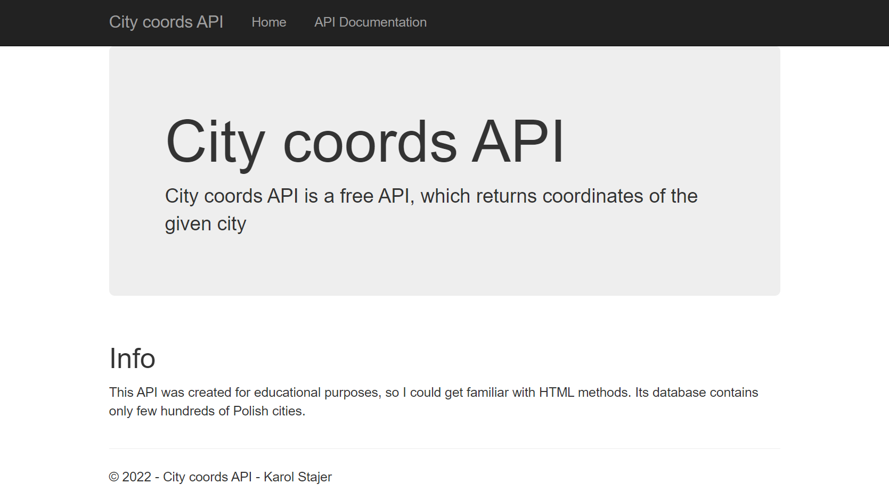
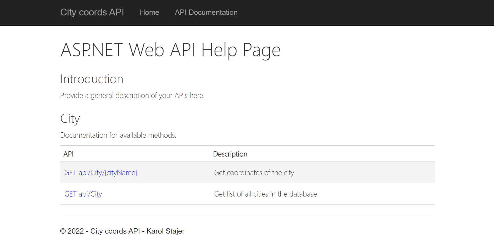
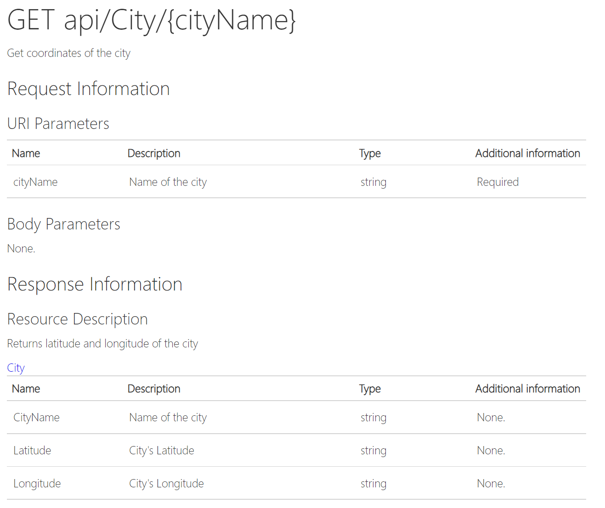

# City coords API

API which returns coordinates of the given city

### Info

This API was made for educational purposes, so I could get familiar with HTML methods. Its database contains only few hundreds of Polish cities.

### Methods

```
/api/city/{cityName}
```
Returns coordinates of the city (latitude and longitude).

```
/api/city
```
Returns a list of all cities in the database with their coordinates.

### Screenshots








